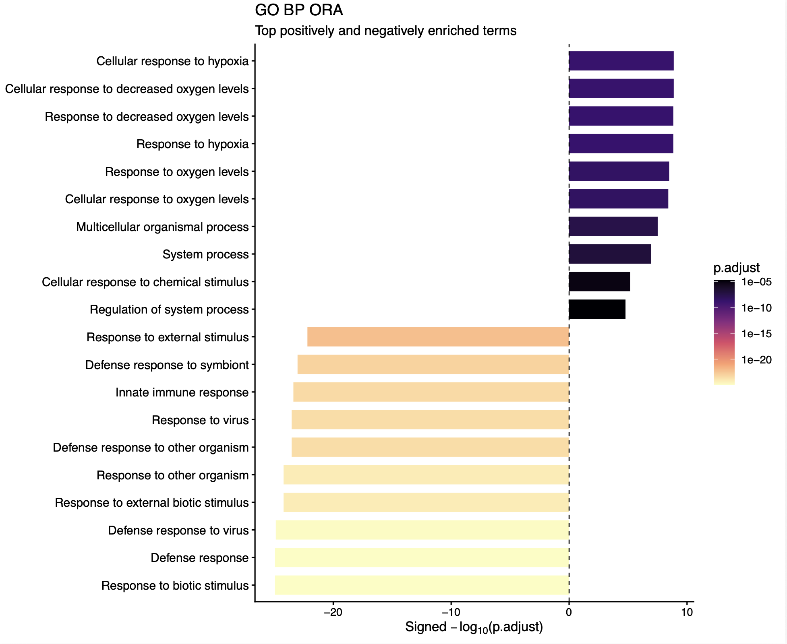
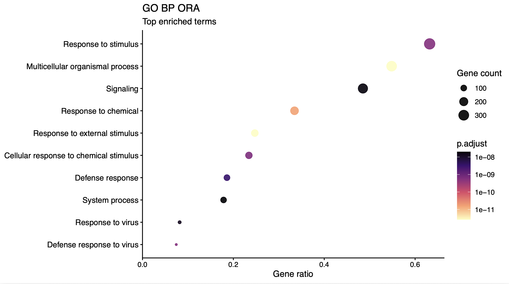
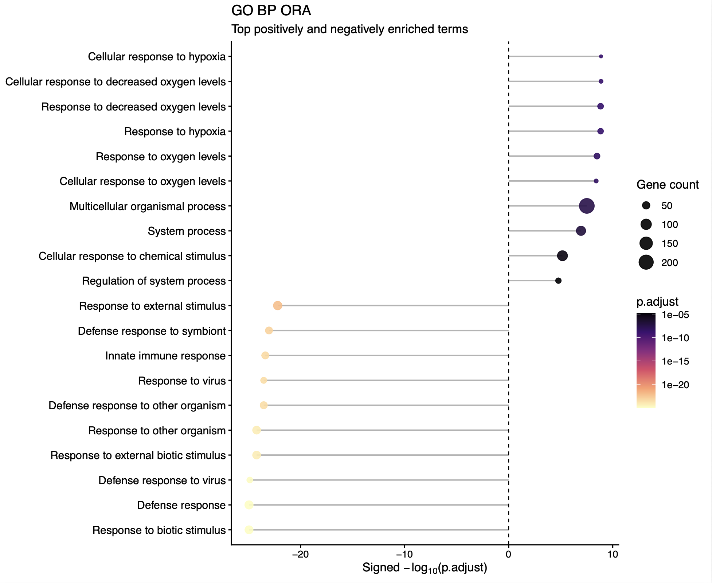
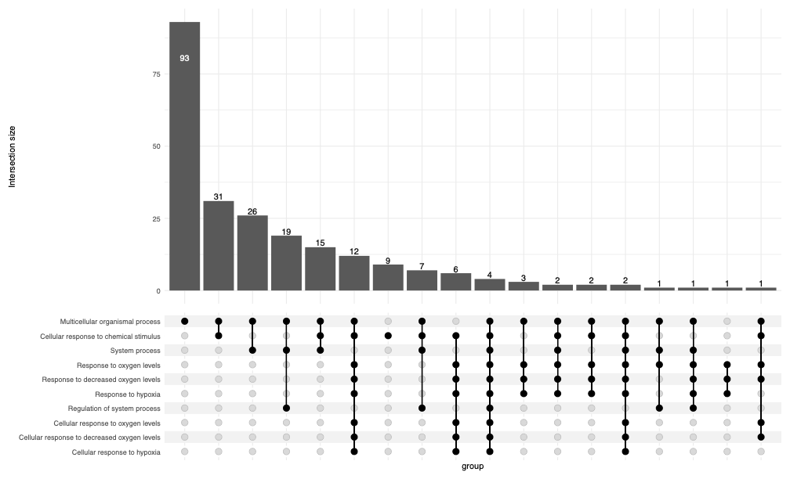
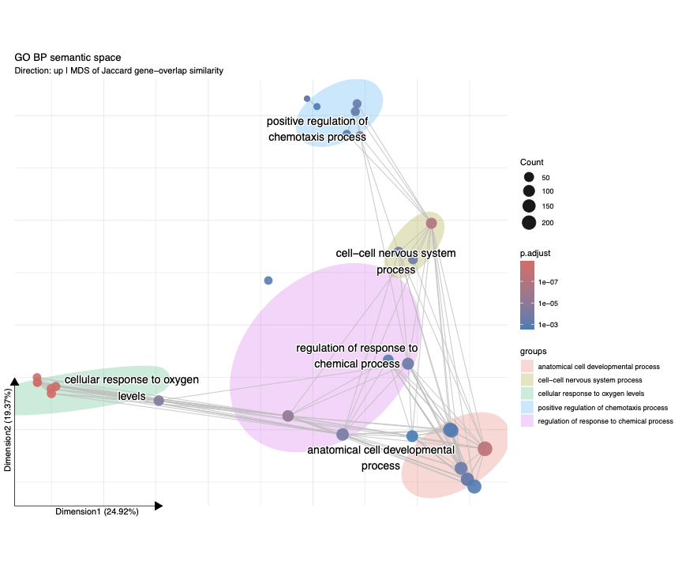
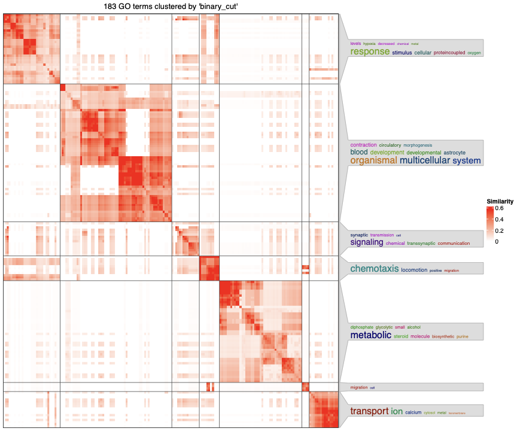

# Visualization of Enriched Terms from ORA

Over-representation analysis (ORA) identifies GO terms that occur more frequently among significant differentially expressed genes (DEGs) than expected relative to a background gene set.


## Input

ORA analysis commands write enrichment tables. ORA plot commands read those tables.

The input to the plotting tools are ORA results generated by gProfiler, clusterProfiler, fgsea, or Enrichr as CSV, TSV, or RDS files.

```bash
enrichviz ora_gprofiler --in edger.csv --outdir ora_out --direction yes
enrichviz ora_enricher --in edger.csv --outdir ora_out --direction yes
enrichviz ora_enricher --in edger.csv --outdir ora_out --gmt genesets.gmt
enrichviz ora_clusterprofiler --in edger.csv --outdir ora_out --direction yes
```

`ora_gprofiler` tests GO with gprofiler2. `ora_enricher` runs the same DEG selection through `clusterProfiler::enricher` (the local hypergeometric test used by `gseapy.enrich`). Without `--gmt` it uses MSigDB GO gene sets. With `--gmt` it uses that GMT file as the gene-set library. `ora_clusterprofiler` runs `clusterProfiler::enrichGO` on the same DEG selection. The background is the measured genes in the DE table.

When --direction yes is specified, ORA is run separately on up- and down-regulated genes; --direction no (the default) tests all significant genes together. 
 
 The examples below use gProfiler results from `enrichviz ora_gprofiler`.

## General settings for all plotting scripts

- Terms with **FDR < 0.05** are retained.
- `--ont BP`, `CC`, or `MF` plots that GO ontology. `--ont KEGG` plots KEGG ids. `--ont all` plots every GO id.
- The typical input is an ORA results table such as `gprofiler_GO.csv`.
- When an `up`/`down` direction column is available, signed axes place up-regulated enrichment on the positive side and down-regulated enrichment on the negative side.

## Choosing a visualization

| Biological question | Recommended plot |
|---|---|
| Which terms are most significant? | Barplot or lollipop |
| What fraction of the query genes belongs to each term? | Dotplot |
| Which terms share the same genes? | UpSet plot |
| Which terms share query genes and form related groups? | Semantic space plot |
| Which GO terms are semantically similar in the GO hierarchy? | simplifyGO |

---

## 1. Barplot (`enrichviz ora_barplot`)

The barplot shows the top significant terms ranked by `p.adjust`. It accepts GO or KEGG ORA tables (and other clusterProfiler/gprofiler/fgsea tables). `--ont` selects GO biological process, cellular component, molecular function, KEGG, or all GO ids, as described above.

**Plot elements**

- **x-axis:** signed −log10(`p.adjust`)
- **y-axis:** term
- **fill:** `p.adjust`

Larger absolute values indicate stronger statistical significance. When direction information is available, terms enriched among up-regulated genes appear to the right of zero and terms enriched among down-regulated genes appear to the left. The top N terms from each direction are shown.



```bash
enrichviz ora_barplot --in ora_out/gprofiler_GO.csv --outdir ora_out --n 10 --ont BP
enrichviz ora_barplot --in ora_out/kegg.csv --outdir ora_out --n 10 --prefix kegg
```

**Output:** `ora_BP_barplot.pdf` (GO) or `ora_KEGG_barplot.pdf` (KEGG). With `--prefix NAME`, files are named `NAME_ora_BP_barplot.pdf` or `NAME_ora_KEGG_barplot.pdf`.

---

## 2. Dotplot (`enrichviz ora_dotplot`)

The dotplot shows the proportion and number of query genes associated with each enriched term. It accepts GO or KEGG ORA tables. `--ont` selects GO biological process, cellular component, molecular function, KEGG, or all GO ids, as described above.

**Plot elements**

- **x-axis:** signed gene ratio
- **y-axis:** term
- **color:** `p.adjust`
- **point size:** gene count

The gene ratio is calculated as:

**Gene ratio = intersection size / query size**

A larger absolute gene ratio indicates that a greater fraction of the query genes belongs to the term. The sign indicates enrichment direction when direction information is available. Point size represents the number of query genes associated with the term.

If the gene ratio is unavailable, the x-axis uses signed −log10(`p.adjust`).



```bash
enrichviz ora_dotplot --in ora_out/gprofiler_GO.csv --outdir ora_out --n 10 --ont BP
enrichviz ora_dotplot --in ora_out/kegg.csv --outdir ora_out --n 10 --prefix kegg
```

**Output:** `ora_BP_dotplot.pdf` (GO) or `ora_KEGG_dotplot.pdf` (KEGG). With `--prefix NAME`, files are named `NAME_ora_BP_dotplot.pdf` or `NAME_ora_KEGG_dotplot.pdf`.

---

## 3. Lollipop plot (`enrichviz ora_lollipop`)

The lollipop plot shows the top significant terms together with their gene counts. It accepts GO or KEGG ORA tables. `--ont` selects GO biological process, cellular component, molecular function, KEGG, or all GO ids, as described above.

**Plot elements**

- **x-axis:** signed −log10(`p.adjust`)
- **y-axis:** term
- **color:** `p.adjust`
- **point size:** gene count

Greater distance from zero indicates stronger statistical significance. The sign indicates enrichment direction when direction information is available. Point size represents the number of query genes associated with each term.

The top N terms from each direction are shown.



```bash
enrichviz ora_lollipop --in ora_out/gprofiler_GO.csv --outdir ora_out --n 10 --ont BP
enrichviz ora_lollipop --in ora_out/kegg.csv --outdir ora_out --n 10 --prefix kegg
```

**Output:** `ora_BP_lollipop.pdf` (GO) or `ora_KEGG_lollipop.pdf` (KEGG). With `--prefix NAME`, files are named `NAME_ora_BP_lollipop.pdf` or `NAME_ora_KEGG_lollipop.pdf`.

---

## 4. UpSet plot (`enrichviz ora_upset`)

The UpSet plot shows gene overlap among the selected enriched terms. Each term represents a set of query genes, and the intersection bars show how many genes are shared by specific combinations of terms. It accepts GO or KEGG ORA tables.

The plot requires gene lists for each term, such as `geneID` or intersection genes in the input table.

`--direction up|down|none` determines which terms are included. `none` selects the top N terms regardless of direction. `--ont` selects GO biological process, cellular component, molecular function, KEGG, or all GO ids, as described above.



```bash
enrichviz ora_upset --in ora_out/gprofiler_GO.csv --outdir ora_out --n 10 --ont BP --direction up
enrichviz ora_upset --in ora_out/kegg.csv --outdir ora_out --n 10 --direction none --prefix kegg
```

**Output:** `ora_BP_up_upset.pdf` (`--direction up`) or `ora_BP_upset.pdf` / `ora_KEGG_upset.pdf` when `--direction none`. With `--prefix NAME`, that name is prepended.

---

## 5. Semantic space plot (`enrichviz ora_ssplot`)

The semantic space plot displays enriched terms in two dimensions based on the **Jaccard similarity of their query genes**. Terms that share more genes are positioned closer together. It accepts GO or KEGG ORA tables.

**Plot elements**

- **point:** term
- **point size:** number of genes
- **point color:** statistical significance
- **grey lines:** pairs of terms with Jaccard similarity ≥ 0.2
- **clusters:** groups identified by k-means clustering

Cluster labels are generated from common words in GO term names and rearranged into GO-style phrases (for example “regulation of … process”). For KEGG, each cluster is labelled with the pathway closest to the cluster centre.



```bash
enrichviz ora_ssplot --in ora_out/gprofiler_GO.csv --outdir ora_out --n 30 --ont BP --direction up
enrichviz ora_ssplot --in ora_out/kegg.csv --outdir ora_out --n 30 --direction none --prefix kegg
```

**Output:** `ora_BP_up_ssplot.pdf` (GO, `--direction up`) or `ora_KEGG_ssplot.pdf` (KEGG, `--direction none`), a coordinate/cluster table, and a similarity RDS file. With `--prefix NAME`, that name is prepended.

The similarity represents **gene overlap**, not semantic similarity within the GO hierarchy.

---

## 6. simplifyGO (`enrichviz ora_simplify`)

simplifyGO groups enriched GO terms according to **semantic similarity within the GO ontology** using `simplifyEnrichment::GO_similarity`.

The heatmap displays pairwise semantic similarity among GO terms, and clustering identifies groups of related terms. Terms within the same cluster represent similar biological concepts according to the GO hierarchy.

The analysis requires `--organism` to specify the appropriate OrgDb.



```bash
enrichviz ora_simplify --in ora_out/gprofiler_GO.csv --outdir ora_out --ont BP --direction up --organism hsapiens
```

**Output:** `GO_BP_up_simplifyGO.pdf` and a cluster table.


## Input file processing

* For most of the plotting tools, **the only required columns in the input file are `Term` and `Significance`.** 
* `Upset plot` and sematic-space plot (`ssplot`) also need a gene column (eg: geneID,Genes,intersection_genes)

Each plot reads that table through one normalizer. Column names from these tools are renamed onto a shared set of columns, then terms are selected with `--ont` and an FDR cutoff of 0.05. The original file is not edited. Header matching ignores capitalization, so `Term` and `term` are the same column.

Two kinds of column are required, whatever tool produced the file. Either name in a pair is enough.

| Column | Accepted headers |
|---|---|
| Term | `term_id`, `ID`, `GO_ID`, `pathway`, or a description such as `term_name`, `Description`, or `Term` |
| Significance | An adjusted p-value (`p.adjust`, `adjusted_p_value`, `padj`, `qvalue`, `FDR`, `Adjusted P-value`) or a raw p-value (`p_value`, `pvalue`, `pval`, `P-value`) |

If the term column is missing, the description is used as the id. If only a raw p-value is present, it is copied into `p.adjust` and used for the FDR cutoff. A table that has neither a term nor a description, or neither an adjusted nor a raw p-value, stops before a plot is written.

Other columns are optional. When present, they are copied onto the shared names below. When absent, the plot still runs, and that column is left empty or filled from a related field. `GeneRatio` of the form `intersection/query`, for example, supplies both the gene count and the query size.

| Shared column | Taken from |
|---|---|
| `ID`, `Description` | term id and term name |
| `p.adjust`, `pvalue` | adjusted and raw p-values |
| `ONTOLOGY` | `ONTOLOGY`, `ontology`, `source`, or `ont`. Values such as `GO:BP` become `BP` |
| `direction` | `direction`, or a cluster column whose values are `up` and `down`. Missing direction is treated as `none` |
| `Count`, `setSize`, `querySize` | intersection size, term size, and query size. Enrichr `Overlap` (`30/207`) supplies the intersection count and the term size |
| `geneID` | `intersection_genes`, `geneID`, `intersections`, `leadingEdge`, or `Genes` |

The database is read from the term ids, not from the file name. One id matching `GO:#####` means the table contains GO. If there is no GO id, one id like `hsa04110` means it contains KEGG. Any other id is a generic term. An Enrichr `Term` such as `Defense Response to Virus (GO:0051607)` is split into that GO id and the name before it.

`--ont` then chooses which of those ids are plotted:

- `BP`, `CC`, or `MF` keeps GO ids of that ontology.
- `KEGG` keeps KEGG ids.
- `all` keeps every GO id and does not split them by ontology.

A gProfiler table often mixes GO, KEGG, transcription-factor, and pathway sources in one file. `--ont BP` plots only the GO biological-process rows. Terms with `p.adjust` missing or not below 0.05 are dropped. If none remain, the command stops and writes no file. UpSet and semantic-space plots also need `geneID`; simplifyGO needs GO ids.
