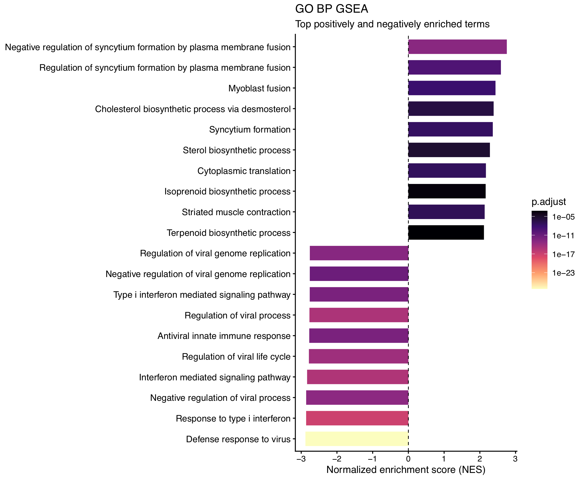
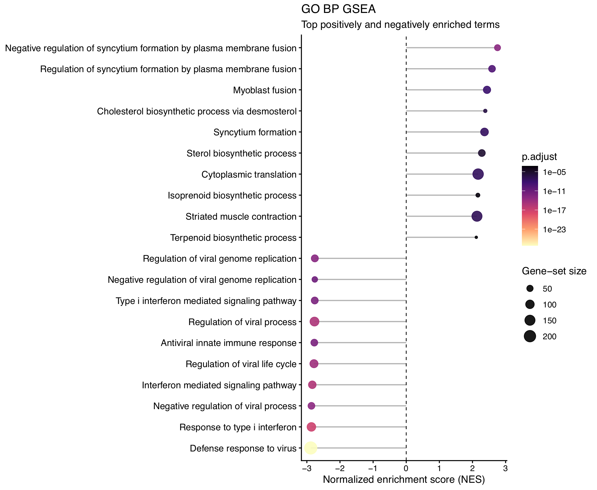
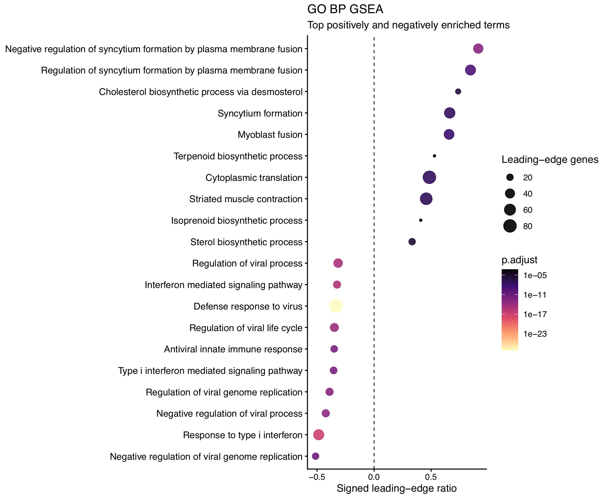
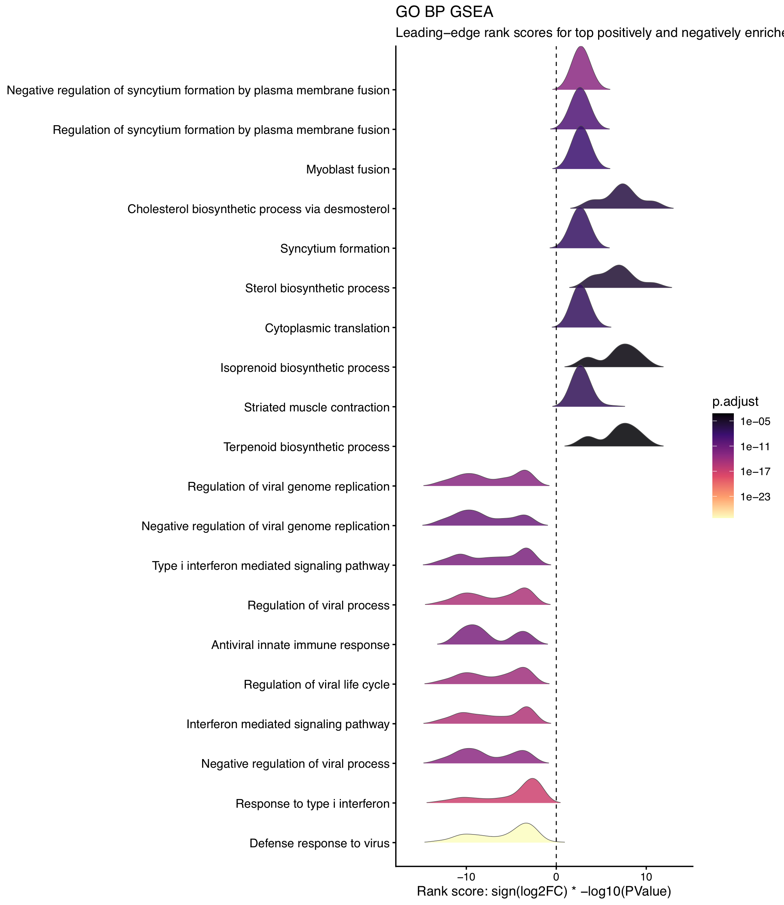
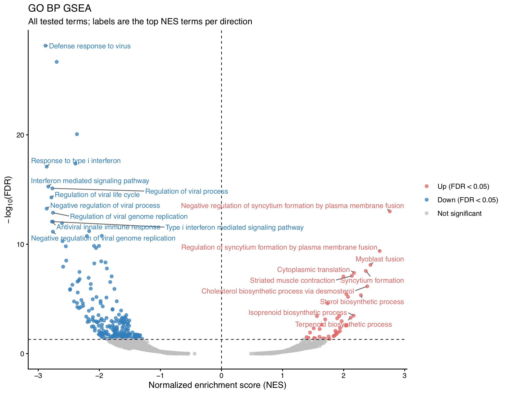
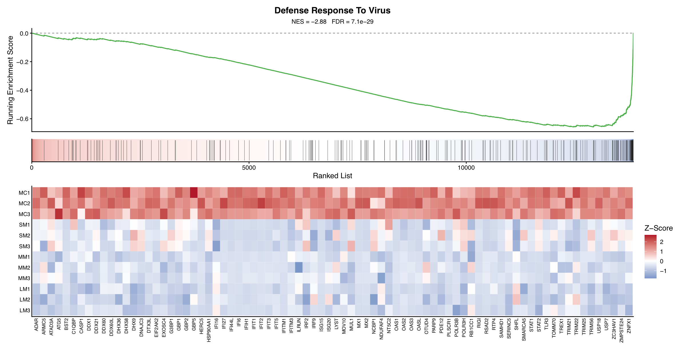
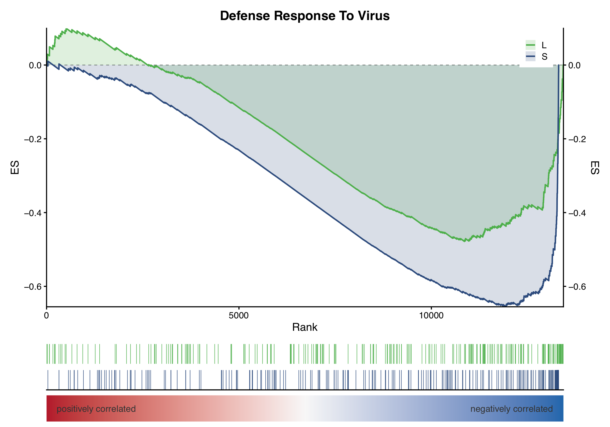

# Visualization of Enriched Terms from GSEA

Gene Set Enrichment Analysis (GSEA) tests whether genes belonging to a biological function are concentrated toward the top or bottom of a ranked gene list. Unlike over-representation analysis (ORA), GSEA uses all tested genes rather than a predefined list of differentially expressed genes.

The scripts described here run GSEA and provide plots for interpreting GO or KEGG enrichment results. All plotting scripts accept both databases, from fgsea or clusterProfiler, as CSV, TSV, or RDS.

Generate the GSEA results using `gsea_GO.R` or `gsea_KEGG.R` (from the repository root: `enrichviz gsea go` / `enrichviz gsea kegg`; plot commands are `enrichviz gsea barplot`, and so on):

```bash
Rscript gsea_GO.R --in edger.csv --outdir gsea_out --ont all
Rscript gsea_KEGG.R --in edger.csv --outdir gsea_out
```

`gsea_KEGG.R` uses MSigDB C2 KEGG Legacy pathways by default (`--kegg legacy`, IDs such as `hsa02010`). Pass `--kegg medicus` for KEGG Medicus. Output files are `ranked_genes_KEGG.csv` / `.rds` and `fgsea_KEGG.csv` / `.rds`. Mouse runs map human KEGG sets to mouse orthologs. clusterProfiler KEGG tables (for example `gseKEGG.csv`) can be plotted the same way.

`--ont BP|CC|MF` selects a GO ontology. KEGG results skip that filter (`--ont KEGG` or `--ont all`). Optional `--prefix NAME` is prepended to plot file names. 

## Gene ranking

Genes are ranked using a statistic that incorporates both the direction and statistical strength of differential expression. The default method is:

```text
--rank signed_logp
```

with:

**Rank score = sign(log₂FC) × −log₁₀(P)**

Positive log₂ fold changes produce positive rank scores, while negative log₂ fold changes produce negative scores. Larger absolute scores indicate stronger evidence for differential expression.

## Key GSEA terms

**Normalized Enrichment Score (NES)** describes the direction and strength of enrichment. Positive NES indicates enrichment toward the top of the ranked list, while negative NES indicates enrichment toward the bottom. With the signed ranking statistic used here, positive and negative NES therefore correspond to enrichment among genes with positive and negative differential expression, respectively.

**Leading-edge genes** are the subset of genes in a gene set that drives the enrichment signal. They include  every gene in the term that appears at or before that peak/trough.

- Positive NES (term at the top of the list): genes from the top of the list down to the maximum of the enrichment-score curve.
- Negative NES (term at the bottom): genes from the bottom of the list up to the minimum of the ES curve.


## Term selection for overview plots

The barplot, lollipop plot, dotplot, and ridgeplot use the same term-selection procedure:

- retain terms with **p.adjust < 0.05**;
- for GO, analyze one ontology at a time: Biological Process (BP), Cellular Component (CC), or Molecular Function (MF);
- for KEGG, skip ontology filtering and use all pathways in the table;
- select the **top N terms separately for positive and negative NES** based on |NES|, with `-n 10` as the default.

The volcano plot displays all tested terms in that same GO ontology or KEGG table and labels only the top N significant terms. Running ES plots examine one GO or KEGG term at a time (`--GO` or `--term`).

## Choosing a visualization

Different GSEA plots emphasize different aspects of the enrichment results. Using several complementary plots can provide a more complete interpretation than relying on a single visualization.


| Biological question                                               | Recommended plot      | Main information                         |
| ----------------------------------------------------------------- | --------------------- | ---------------------------------------- |
| Which terms show the strongest enrichment?                        | Barplot or lollipop   | NES magnitude and direction              |
| How much of the gene set contributes to enrichment?               | Dotplot               | Leading-edge proportion                  |
| Where do the leading-edge genes occur in the ranked list?         | Ridgeplot             | Distribution of gene-level rank scores   |
| How are enrichment strength and statistical significance related? | Volcano plot          | NES versus `p.adjust`                    |
| How does enrichment develop across the ranked gene list?          | Running ES / NES plot | Enrichment trajectory for one term       |
| How does the same term behave across conditions?                  | NES comparison        | Enrichment trajectories across GSEA runs |


Barplots and lollipop plots provide a concise overview of the strongest enriched functions. Dotplots provide additional information about the genes driving the enrichment. Ridgeplots show how strongly those genes are positioned within the ranked list. Volcano plots provide a global view of all tested terms. Running ES plots allow detailed examination of individual GO or KEGG terms.

---

# 1. Barplot (`gsea_barplot.R`)

The barplot shows the terms with the strongest significant positive and negative enrichment. Both GO and KEGG results from GSEA are supported.

## What is shown

- **x-axis:** NES
- **y-axis:** terms
- **bar length:** magnitude of NES
- **fill:** adjusted P value (`p.adjust`)

Negative NES values extend to the left of zero and positive values to the right. Longer bars indicate stronger enrichment. Fill represents statistical significance.



## How to run

```bash
Rscript gsea_barplot.R --in gsea_out/fgsea_GO_all.csv --outdir gsea_out --n 10 --ont BP
Rscript gsea_barplot.R --in gsea_out/fgsea_KEGG.csv --outdir gsea_out --n 10 
```

### Output

```text
gsea_BP_barplot.pdf
gsea_BP_barplot_table.csv
```

With `--prefix NAME`, files are named `NAME_gsea_BP_barplot.pdf`. KEGG tables write `gsea_KEGG_barplot.pdf`.

---

# 2. Lollipop plot (`gsea_lollipop.R`)

The lollipop plot shows enrichment strength, statistical significance, and gene-set size for the selected terms. Both GO and KEGG results from GSEA are supported.

## What is shown

- **x-axis:** NES
- **y-axis:** terms
- **color:** adjusted P value (`p.adjust`)
- **point size:** total gene-set size (`size` or `setSize`)

Points to the right of zero have positive NES and points to the left have negative NES. Distance from zero represents enrichment strength. Point size represents the total number of genes from the term included in the GSEA analysis, not the number of leading-edge genes.



## How to run

```bash
Rscript gsea_lollipop.R --in gsea_out/fgsea_GO_all.csv --outdir gsea_out --n 10 --ont BP
Rscript gsea_lollipop.R --in t5/fgsea_KEGG.csv --outdir gsea_out --n 10 
```

### Output

```text
gsea_BP_lollipop.pdf
gsea_BP_lollipop_table.csv
```

With `--prefix NAME`, files are named `NAME_gsea_BP_lollipop.pdf`. KEGG tables write `gsea_KEGG_lollipop.pdf`.

---

# 3. Dotplot (`gsea_dotplot.R`)

The dotplot shows the contribution of leading-edge genes to each enriched term. Both GO and KEGG results from GSEA are supported.

The **leading-edge ratio** is calculated as:

**Leading-edge ratio = number of leading-edge genes / gene-set size**

The ratio ranges from 0 to 1. For visualization, the sign of NES is assigned to the ratio so that positive and negative enrichment appear on opposite sides of zero.

## What is shown

- **x-axis:** signed leading-edge ratio
- **y-axis:** terms
- **color:** adjusted P value (`p.adjust`)
- **point size:** number of leading-edge genes

A point farther from zero indicates that a larger fraction of the gene set belongs to the leading edge. Positive and negative values indicate positive and negative NES, respectively. Point size represents the absolute number of leading-edge genes, while the x-axis represents their proportion within the gene set.

Term selection is based on |NES|, but terms are displayed according to their signed leading-edge ratios. 



## How to run

```bash
Rscript gsea_dotplot.R --in gsea_out/fgsea_GO_all.csv --outdir gsea_out --n 10 --ont BP
Rscript gsea_dotplot.R --in t5/fgsea_KEGG.csv --outdir gsea_out --n 10 
```

### Output

```text
gsea_BP_dotplot.pdf
gsea_BP_dotplot_table.csv
```

With `--prefix NAME`, files are named `NAME_gsea_BP_dotplot.pdf`. KEGG tables write `gsea_KEGG_dotplot.pdf`.

---

# 4. Ridgeplot (`gsea_ridgeplot.R`)

The ridgeplot shows the distribution of ranking scores among the leading-edge genes for each enriched term. It requires both the GSEA result and the ranked gene table used for GSEA. Both GO and KEGG results from GSEA are supported.

## What is shown

- **x-axis:** ranking score of each leading-edge gene
- **y-axis:** terms
- **ridge:** distribution of leading-edge gene ranking scores
- **fill:** adjusted P value (`p.adjust`)

A ridge concentrated to the right of zero indicates predominantly positive ranking scores, while a ridge concentrated to the left indicates predominantly negative ranking scores.

A **narrow peak** indicates that many of the leading-edge genes have similar ranking scores. A **broader distribution** indicates that their ranking scores are spread across a wider range. Ridge height reflects the relative density of ranking scores and does not represent the number of genes.

The terms are ordered by NES. Statistical significance is represented by the fill color.



## How to run

```bash
Rscript gsea_ridgeplot.R \
  --in gsea_out/fgsea_GO_all.csv \
  --rank gsea_out/ranked_genes_GO.csv \
  --outdir gsea_out --n 10 --ont BP
Rscript gsea_ridgeplot.R \
  --in t5/fgsea_KEGG.csv \
  --rank t5/ranked_genes_KEGG.csv \
  --outdir gsea_out --n 10 --prefix kegg
```

Optional `--prefix NAME` is prepended to the output files.

### Output

```text
gsea_BP_ridgeplot.pdf
gsea_BP_ridgeplot_table.csv
```

With `--prefix NAME`, files are named `NAME_gsea_BP_ridgeplot.pdf`. KEGG tables write `gsea_KEGG_ridgeplot.pdf`.

---

# 5. Volcano plot (`gsea_volcano.R`)

The GSEA volcano plot shows enrichment strength and statistical significance across all tested terms. Both GO and KEGG results from fgsea or clusterProfiler are supported.

Volcano plot plots all terms as points.  `-n` controls the number of labeled terms, not the number of points displayed.

## What is shown

- **x-axis:** NES
- **y-axis:** −log₁₀(`p.adjust`)
- **color:** enrichment category
- **vertical reference line:** NES = 0
- **horizontal reference line:** `p.adjust` = 0.05
- **labels:** top N significant terms in each direction ranked by |NES|

Terms above the horizontal threshold are significant. Terms to the right have positive NES and terms to the left have negative NES. Greater horizontal distance from zero indicates stronger enrichment, while greater vertical position indicates stronger statistical significance.

For GO tables, `--ont BP`, `CC`, or `MF` selects one ontology (`--ont all` keeps every GO ontology in the file). For KEGG tables, ontology filtering is skipped. If the default `--ont BP` is left in place, the script reports that BP is GO-specific and plots all KEGG pathways.

fgsea tables usually include non-significant terms, so the grey cloud below the FDR line is visible. clusterProfiler `gseKEGG` tables often contain only significant pathways, so most points sit above the line.



## How to run

```bash
Rscript gsea_volcano.R --in gsea_out/fgsea_GO_all.csv --outdir gsea_out --n 10 --ont BP
Rscript gsea_volcano.R --in gsea_out/fgsea_KEGG.csv --outdir gsea_out --n 10 
```

### Output

```text
gsea_BP_volcano.pdf
gsea_BP_volcano_table.csv
```

With `--prefix NAME`, files are named `NAME_gsea_BP_volcano.pdf`. KEGG tables write `gsea_KEGG_volcano.pdf`.

---

# 6. Running ES / NES plot (`gsea_NES.R`)

The running enrichment-score plot shows how the enrichment signal for one GO or KEGG term develops across the complete ranked gene list. Use `--GO` or `--term` with a GO ID (`GO:0051607`) or a KEGG ID (`hsa03010`).

## What is shown

The plot contains two main panels and can optionally include an expression heatmap.

### Running enrichment score

The enrichment-score curve is calculated while moving from the top to the bottom of the ranked gene list. NES and FDR are reported in the subtitle.

For a positively enriched term, the curve reaches a positive maximum toward the top of the ranked list. For a negatively enriched term, it develops a negative minimum toward the bottom. The position of the maximum or minimum indicates where the enrichment signal is concentrated.

### Ranked gene list

The ranked gene list is displayed using a color gradient based on the ranking statistic. Vertical ticks mark the positions of genes belonging to the selected term.

### Optional expression heatmap

An expression heatmap can be generated using `--expr` with a differential-expression table containing normalized count columns after `falsePos`.

- **columns:** leading-edge genes ordered by ranked-list position
- **rows:** samples in their original order
- **fill:** row z-score calculated independently for each gene

Genes and samples are not clustered. Heatmap colors represent relative expression within each gene and should not be interpreted as NES or as absolute expression differences between genes.



## How to run

Using the GSEA result alone:

```bash
Rscript gsea_NES.R \
  --in gsea_out/fgsea_GO_all.csv \
  --GO GO:0051607 \
  --outdir gsea_out
```

KEGG example:

```bash
Rscript gsea_NES.R \
  --in gsea_out/fgsea_KEGG.csv \
  --term hsa03010 \
  --outdir gsea_out --prefix kegg
```

Including the expression heatmap:

```bash
Rscript gsea_NES.R \
  --in gsea_out/fgsea_GO_all.csv \
  --GO GO:0051607 \
  --expr edger.csv \
  --outdir gsea_out
```

### Output

```text
gsea_GO_0051607_NES.pdf
gsea_GO_0051607_NES_table.csv
```

With `--prefix NAME`, files are named `NAME_gsea_GO_0051607_NES.pdf`. KEGG IDs write `gsea_hsa03010_NES.pdf`.

The `--rank` argument is required only when the supplied RDS does not contain the ranked gene list. For a clusterProfiler KEGG CSV, pass `--rank ranked_genes_KEGG.csv` (or the corresponding RDS) so symbols can be matched to Ensembl IDs.

---

# 7. Comparing NES profiles across conditions (`gsea_NES_compare.R`)

The NES comparison plot shows the enrichment trajectory of the same GO or KEGG term across multiple GSEA analyses. Use `--GO` or `--term` with the term ID.

## What is shown

For each condition, the plot contains:

- a running enrichment-score curve;
- a corresponding filled region;
- a barcode row marking the positions of gene-set members.

The left side represents the top of the ranked list and the right side represents the bottom.

Each curve is calculated from the ranked gene list for its corresponding condition. The x-axis therefore represents rank position within each condition's own list. Ranked lists do not need to contain the same number of genes.

A higher positive peak indicates stronger positive enrichment, while a deeper negative trough indicates stronger negative enrichment. Differences in peak or trough position indicate that the enrichment signal is concentrated at different regions of the ranked lists. Interpretation should consider both the reported NES and the shape and position of each curve.

The comparison requires at least two GSEA inputs. RDS files are preferred because they retain the information required to reconstruct the complete enrichment curves. A result table can also be used when the corresponding ranked list is supplied with `--rank`.



## How to run

Inputs can be assigned condition names directly:

```bash
Rscript gsea_NES_compare.R \
  --GO GO:0051607 \
  --in young=gsea_out/young_fgsea_GO_all.rds,old=gsea_out/old_fgsea_GO_all.rds \
  --outdir gsea_out
```

KEGG example:

```bash
Rscript gsea_NES_compare.R \
  --term hsa03010 \
  --in young=gsea_out/young_fgsea_KEGG.rds,old=gsea_out/old_fgsea_KEGG.rds \
  --outdir gsea_out --prefix kegg
```

Alternatively, unlabeled input files can be combined with `--labels`:

```bash
Rscript gsea_NES_compare.R \
  --GO GO:0051607 \
  --in a.rds,b.rds \
  --labels A,B \
  --outdir gsea_out --prefix young_vs_old
```

### Output

```text
gsea_GO_0051607_NES_compare.pdf
gsea_GO_0051607_NES_compare_table.csv
```

With `--prefix NAME`, files are named `NAME_gsea_GO_0051607_NES_compare.pdf`. KEGG IDs write `gsea_hsa03010_NES_compare.pdf`.

The output table reports NES and FDR for the selected term in each condition.


