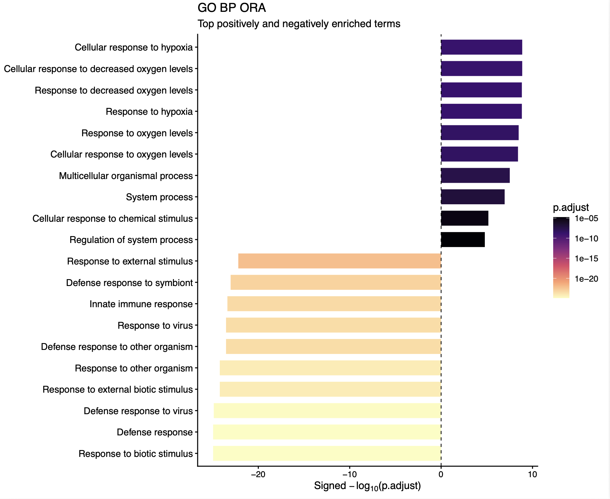
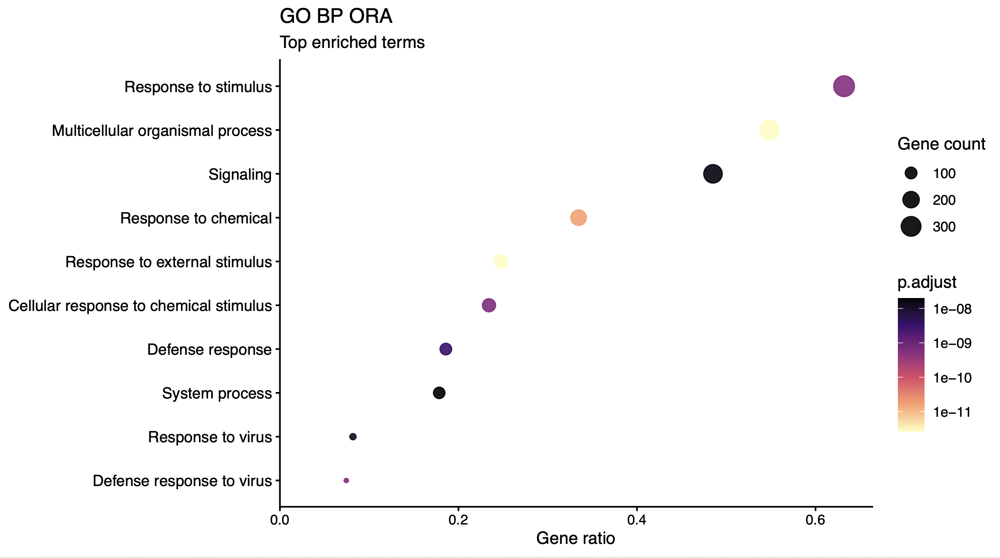
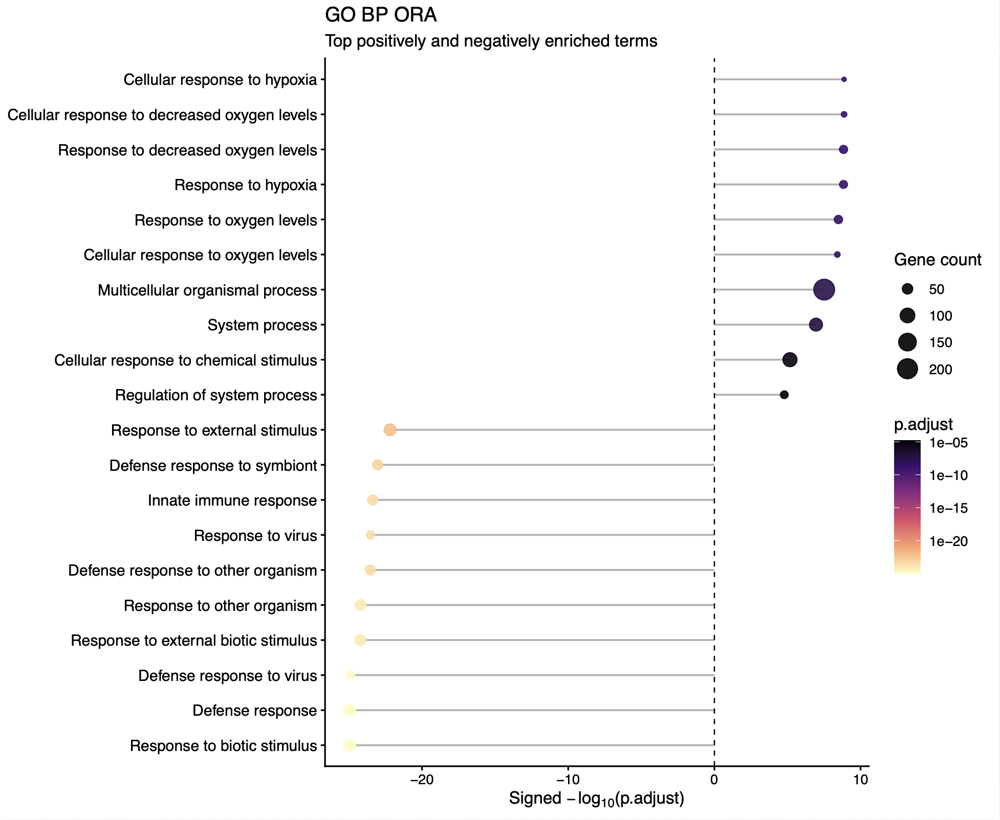
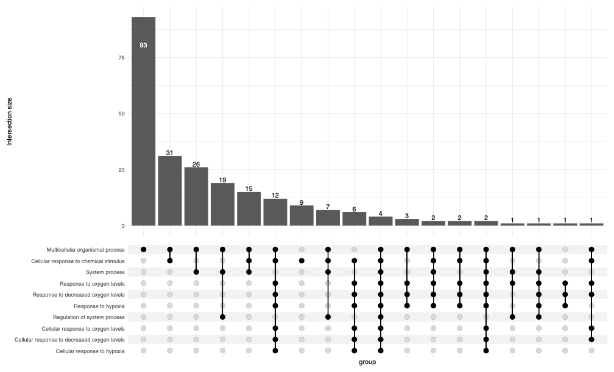
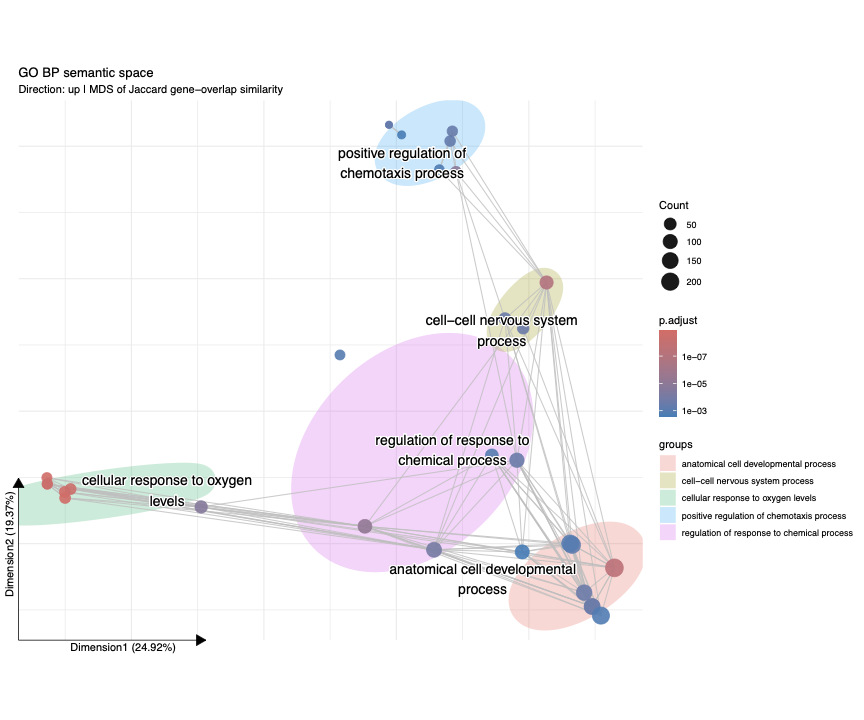
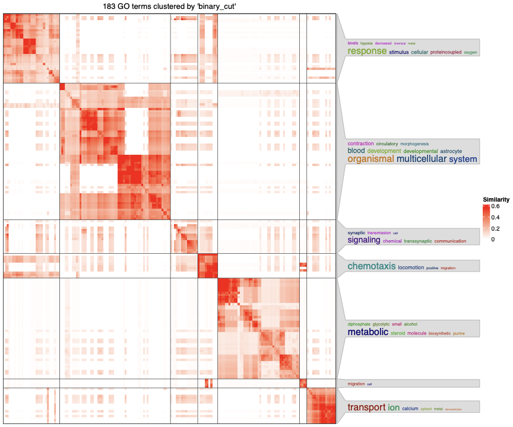

# Visualization of Enriched Terms from ORA

Over-representation analysis (ORA) identifies GO terms that occur more frequently among significant differentially expressed genes (DEGs) than expected relative to a background gene set.

The plotting commands accept ORA results generated by gProfiler, clusterProfiler, or fgsea as CSV, TSV, or RDS files. The examples below use gProfiler results from `enrichviz ora gprofiler`. 

```bash
enrichviz ora gprofiler --in edger.csv --outdir ora_out --direction yes
```

When --direction yes is specified, up- and down-regulated genes are separately; --direction no (the default) tests all significant genes together. 

## General settings

- Terms with **FDR < 0.05** are retained.
- One GO ontology is plotted at a time: Biological Process (BP), Cellular Component (CC), or Molecular Function (MF).
- The typical input is an ORA results table such as `gprofiler_GO.csv`.
- When an `up`/`down` direction column is available, signed axes place up-regulated enrichment on the positive side and down-regulated enrichment on the negative side.

## Choosing a visualization

| Biological question | Recommended plot |
|---|---|
| Which terms are most significant? | Barplot or lollipop |
| What fraction of the query genes belongs to each term? | Dotplot |
| Which terms share the same genes? | UpSet plot |
| Which terms share query genes and form related groups? | Semantic space plot |
| Which GO terms are semantically similar in the GO hierarchy? | simplifyGO |

---

## 1. Barplot (`enrichviz ora barplot`)

The barplot shows the top significant terms ranked by `p.adjust`. It accepts GO or KEGG ORA tables (and other clusterProfiler/gprofiler/fgsea tables). For GO, `--ont BP`, `CC`, or `MF` selects one ontology. For KEGG, ontology filtering is skipped.

**Plot elements**

- **x-axis:** signed −log10(`p.adjust`)
- **y-axis:** term
- **fill:** `p.adjust`

Larger absolute values indicate stronger statistical significance. When direction information is available, terms enriched among up-regulated genes appear to the right of zero and terms enriched among down-regulated genes appear to the left. The top N terms from each direction are shown.



```bash
enrichviz ora barplot --in ora_out/gprofiler_GO.csv --outdir ora_out --n 10 --ont BP
enrichviz ora barplot --in ora_out/kegg.csv --outdir ora_out --n 10 --prefix kegg
```

**Output:** `ora_BP_barplot.pdf` (GO) or `ora_KEGG_barplot.pdf` (KEGG). With `--prefix NAME`, files are named `NAME_ora_BP_barplot.pdf` or `NAME_ora_KEGG_barplot.pdf`.

---

## 2. Dotplot (`enrichviz ora dotplot`)

The dotplot shows the proportion and number of query genes associated with each enriched term. It accepts GO or KEGG ORA tables. For GO, `--ont BP`, `CC`, or `MF` selects one ontology. For KEGG, ontology filtering is skipped.

**Plot elements**

- **x-axis:** signed gene ratio
- **y-axis:** term
- **color:** `p.adjust`
- **point size:** gene count

The gene ratio is calculated as:

**Gene ratio = intersection size / query size**

A larger absolute gene ratio indicates that a greater fraction of the query genes belongs to the term. The sign indicates enrichment direction when direction information is available. Point size represents the number of query genes associated with the term.

If the gene ratio is unavailable, the x-axis uses signed −log10(`p.adjust`).



```bash
enrichviz ora dotplot --in ora_out/gprofiler_GO.csv --outdir ora_out --n 10 --ont BP
enrichviz ora dotplot --in ora_out/kegg.csv --outdir ora_out --n 10 --prefix kegg
```

**Output:** `ora_BP_dotplot.pdf` (GO) or `ora_KEGG_dotplot.pdf` (KEGG). With `--prefix NAME`, files are named `NAME_ora_BP_dotplot.pdf` or `NAME_ora_KEGG_dotplot.pdf`.

---

## 3. Lollipop plot (`enrichviz ora lollipop`)

The lollipop plot shows the top significant terms together with their gene counts. It accepts GO or KEGG ORA tables. For GO, `--ont BP`, `CC`, or `MF` selects one ontology. For KEGG, ontology filtering is skipped.

**Plot elements**

- **x-axis:** signed −log10(`p.adjust`)
- **y-axis:** term
- **color:** `p.adjust`
- **point size:** gene count

Greater distance from zero indicates stronger statistical significance. The sign indicates enrichment direction when direction information is available. Point size represents the number of query genes associated with each term.

The top N terms from each direction are shown.



```bash
enrichviz ora lollipop --in ora_out/gprofiler_GO.csv --outdir ora_out --n 10 --ont BP
enrichviz ora lollipop --in ora_out/kegg.csv --outdir ora_out --n 10 --prefix kegg
```

**Output:** `ora_BP_lollipop.pdf` (GO) or `ora_KEGG_lollipop.pdf` (KEGG). With `--prefix NAME`, files are named `NAME_ora_BP_lollipop.pdf` or `NAME_ora_KEGG_lollipop.pdf`.

---

## 4. UpSet plot (`enrichviz ora upset`)

The UpSet plot shows gene overlap among the selected enriched terms. Each term represents a set of query genes, and the intersection bars show how many genes are shared by specific combinations of terms. It accepts GO or KEGG ORA tables.

The plot requires gene lists for each term, such as `geneID` or intersection genes in the input table.

`--direction up|down|none` determines which terms are included. `none` selects the top N terms regardless of direction. For GO, `--ont BP`, `CC`, or `MF` selects one ontology. For KEGG, ontology filtering is skipped.



```bash
enrichviz ora upset --in ora_out/gprofiler_GO.csv --outdir ora_out --n 10 --ont BP --direction up
enrichviz ora upset --in ora_out/kegg.csv --outdir ora_out --n 10 --direction none --prefix kegg
```

**Output:** `ora_BP_up_upset.pdf` (`--direction up`) or `ora_BP_upset.pdf` / `ora_KEGG_upset.pdf` when `--direction none`. With `--prefix NAME`, that name is prepended.

---

## 5. Semantic space plot (`enrichviz ora ssplot`)

The semantic space plot displays enriched terms in two dimensions based on the **Jaccard similarity of their query genes**. Terms that share more genes are positioned closer together. It accepts GO or KEGG ORA tables.

**Plot elements**

- **point:** term
- **point size:** number of genes
- **point color:** statistical significance
- **grey lines:** pairs of terms with Jaccard similarity ≥ 0.2
- **clusters:** groups identified by k-means clustering

Cluster labels are generated from common words in GO term names and rearranged into GO-style phrases (for example “regulation of … process”). For KEGG, each cluster is labelled with the pathway closest to the cluster centre.



```bash
enrichviz ora ssplot --in ora_out/gprofiler_GO.csv --outdir ora_out --n 30 --ont BP --direction up
enrichviz ora ssplot --in ora_out/kegg.csv --outdir ora_out --n 30 --direction none --prefix kegg
```

**Output:** `ora_BP_up_ssplot.pdf` (GO, `--direction up`) or `ora_KEGG_ssplot.pdf` (KEGG, `--direction none`), a coordinate/cluster table, and a similarity RDS file. With `--prefix NAME`, that name is prepended.

The similarity represents **gene overlap**, not semantic similarity within the GO hierarchy.

---

## 6. simplifyGO (`enrichviz ora simplify`)

simplifyGO groups enriched GO terms according to **semantic similarity within the GO ontology** using `simplifyEnrichment::GO_similarity`.

The heatmap displays pairwise semantic similarity among GO terms, and clustering identifies groups of related terms. Terms within the same cluster represent similar biological concepts according to the GO hierarchy.

The analysis requires `--organism` to specify the appropriate OrgDb.



```bash
enrichviz ora simplify --in ora_out/gprofiler_GO.csv --outdir ora_out --ont BP --direction up --organism hsapiens
```

**Output:** `GO_BP_up_simplifyGO.pdf` and a cluster table.


